# 画面遷移図

システム全体の画面遷移。個々の機能内の詳細な画面遷移（新規登録・確認・詳細・更新・削除等）は各機能の基本設計書の「画面遷移」節（`00_*共通.md` §00.5 等）を参照する。

## 図



> 図のソースは [`画面遷移図.01.mmd`](./画面遷移図.01.mmd)（mermaid）。編集後は次で再生成する（プロジェクトのルートフォルダで実行。要 Docker Desktop 起動）:
>
> ```powershell
> docker run --rm -v ${PWD}:/data minlag/mermaid-cli:11.12.0 -i docs/specs/02_basic-design/画面遷移図.01.mmd -o docs/specs/02_basic-design/画面遷移図.01.svg
> ```
>
> 生成手順の詳細は [`docs/diagrams.md`](../../diagrams.md) を参照。

## 画面一覧との対応

図中の画面IDは各機能の基本設計書の画面一覧（`00_*共通.md` §00.4 等）と対応する。

| 画面ID | 画面名 | URL | 詳細 |
| --- | --- | --- | --- |
| LGN-01 | ログイン画面 | `/login` | [`login/10_ログイン画面.md`](login/10_ログイン画面.md) |
| LGN-02 | パスワード変更画面 | `/settings/password` | [`login/11_初回パスワード変更画面.md`](login/11_初回パスワード変更画面.md) |
| （画面IDなし） | システム紹介 | `/introduction`（別タブ） | 未ログインでも開ける公開ページ（→ [`login/10_ログイン画面.md` 10.7](login/10_ログイン画面.md#107-ルートガード)） |
| （画面IDなし） | システムの詳細 | `/about`（別タブ） | 未ログインでも開ける公開ページ（→ [`login/10_ログイン画面.md` 10.7](login/10_ログイン画面.md#107-ルートガード)） |
| PWR-01 | パスワード再発行の申請 | `/forgot-password` | [`password-reset/10_再発行申請.md`](password-reset/10_再発行申請.md) |
| PWR-02 | パスワードの再設定 | `/reset-password/[token]` | [`password-reset/11_パスワード再設定.md`](password-reset/11_パスワード再設定.md) |
| EML-01 | メールアドレスの変更 | `/settings/email` | [`password-reset/20_メールアドレス管理.md` §20.2](password-reset/20_メールアドレス管理.md#202-本人による変更eml-01) |
| EML-02 | メールアドレス変更の確認 | `/settings/email/confirm/[token]` | [`password-reset/20_メールアドレス管理.md` §20.3](password-reset/20_メールアドレス管理.md#203-確認用urlを開いたときeml-02) |
| （画面IDなし） | トップ画面（ダッシュボード） | `/` | [`dashboard/README.md`](dashboard/README.md) |
| MST-01 | マスタ検索一覧画面 | `/master` | [`master/10_マスタ検索一覧.md`](master/10_マスタ検索一覧.md) |
| PTY-01 | 契約先検索一覧画面 | `/parties` | [`party-contract/10_契約先検索一覧.md`](party-contract/10_契約先検索一覧.md) |
| CTR-01 | 契約検索一覧画面 | `/contracts` | [`party-contract/20_契約検索一覧.md`](party-contract/20_契約検索一覧.md) |
| NEWS-02 | お知らせ管理画面 | `/news` | [`news/20_お知らせ管理一覧.md`](news/20_お知らせ管理一覧.md) |
| （画面IDなし） | 利用者管理画面 | `/admin/users` | 専用の基本設計書は無い。メールアドレス変更の拡張分のみ [`password-reset/20_メールアドレス管理.md` §20.1](password-reset/20_メールアドレス管理.md#201-管理者による登録と変更) に記載 |

マスタ分類一覧（MST-06）・マスタ情報Excel取得（MST-11）等、共通メニューから直接は開けず機能内の画面から辿り着く画面は、この図には含めない。各機能の基本設計書の画面遷移節を参照すること。

## 図の見方

図は画面から画面への主な移動のきっかけだけを表す。**ロールやログイン状態によるルートガードの差し戻し・ログアウトは、矢印が輻輳して読みにくくなるため図には描かず、この節で文章として説明する。**

- **「未ログインでも開ける画面」**：`/login`・`/introduction`・`/about`・`/forgot-password`・`/reset-password/[token]`。これ以外の画面を未ログインで開こうとすると、ルートガードによりログイン画面（LGN-01）へ差し戻される。逆に、ログイン済みの状態で`/login`を開いた場合はトップ画面（`/`）へ遷移する。条件の一覧は [`login/10_ログイン画面.md` 10.7](login/10_ログイン画面.md#107-ルートガード)を参照。
- **「ログイン後の主要画面」**：共通のサイドメニュー（[`src/shared/layout/nav-config.ts`](../../../src/shared/layout/nav-config.ts)）に載っており、ログイン後はどの画面からでも直接移動できる。図では見やすさのためトップ画面からの矢印だけを描いている。
- **お知らせ管理画面（NEWS-02）・利用者管理画面**：それぞれ対象外のロール（VIEWER／ADMIN以外）が直接URLを開いた場合、ルートガードによりトップ画面へ差し戻される（→ [`login/10_ログイン画面.md` 10.7](login/10_ログイン画面.md#107-ルートガード)）。
- **パスワード変更画面（LGN-02）**：初回ログイン時（`mustChangePassword = true`）はルートガードにより強制的に開かされる（図の該当矢印）。変更に成功すると、その場で自動ログアウトしログイン画面へ戻る。同じ入力フォームは、画面右上のユーザーメニューの「パスワード変更」からも、画面遷移を伴わない小窓として開ける（→ [`login/11_初回パスワード変更画面.md`](login/11_初回パスワード変更画面.md)）。
- **メールアドレスの変更（EML-01）**：本人がメールアドレスを変更する画面。**現時点でこの画面へのアプリ内リンクは無く**、URLを直接開く運用になっている。管理者による変更は利用者管理画面の中で直接書き換える方式で、確認用URL（EML-02）は使わない（→ [`password-reset/20_メールアドレス管理.md` §20.1](password-reset/20_メールアドレス管理.md#201-管理者による登録と変更)）。
- **ログアウト**：画面右上のユーザーメニューから、ログイン後のどの画面からでも行える。ログイン画面へ戻る。
