# データベース仕様

システム全体のテーブル構成とER図。個々の機能固有の制約・業務ルールは各機能の基本設計書（`docs/specs/02_basic-design/<機能>/01_データベース.md`）を参照する。全体の技術方針は [`foundation_plan.md` §4](../../foundation_plan.md#4-データベース) を見ること。

## 98.1 ER図



> 図のソースは [`db_spec.01.mmd`](./db_spec.01.mmd)（mermaid）。編集後は次で再生成する（プロジェクトのルートフォルダで実行。要 Docker Desktop 起動）:
>
> ```powershell
> docker run --rm -v ${PWD}:/data minlag/mermaid-cli:11.12.0 -i docs/specs/98_db/db_spec.01.mmd -o docs/specs/98_db/db_spec.01.svg
> ```
>
> 生成手順の詳細は [`docs/diagrams.md`](../../diagrams.md) を参照。`createdBy` / `updatedBy` / `requestedBy` / `userId` は `User.id` への論理参照（§98.5）であり、外部キーを張らないため図の関連線には含めていない。

## 98.2 テーブル一覧

| テーブル（Prismaモデル） | 役割 | 詳細 |
| --- | --- | --- |
| `User` | 認証・RBACに使う利用者情報 | 本書 §98.3。パスワード再設定・メール変更に関わる項目は [`password-reset/01_データベース.md` §01.2](../02_basic-design/password-reset/01_データベース.md#012-user-の変更) |
| `PasswordResetToken` | パスワード再設定用URLの発行記録 | [`password-reset/01_データベース.md` §01.3](../02_basic-design/password-reset/01_データベース.md#013-passwordresettoken) |
| `EmailChangeToken` | メールアドレス変更申込の記録 | [`password-reset/01_データベース.md` §01.4](../02_basic-design/password-reset/01_データベース.md#014-emailchangetoken) |
| `News` | ダッシュボードに表示するお知らせ | [`news/01_データベース.md`](../02_basic-design/news/01_データベース.md) |
| `MasterCategory` | マスタの分類 | [`master/01_データベース.md`](../02_basic-design/master/01_データベース.md) |
| `Master` | マスタ本体 | [`master/01_データベース.md`](../02_basic-design/master/01_データベース.md) |
| `Party` | 契約先 | [`party-contract/01_データベース.md`](../02_basic-design/party-contract/01_データベース.md) |
| `Contract` | 契約 | [`party-contract/01_データベース.md`](../02_basic-design/party-contract/01_データベース.md) |
| `ContractItem` | 契約条項・構成要素（金額計算の対象） | 本書 §98.4（専用の基本設計書は無い） |
| `MasterExcelExport` | マスタ情報Excel取得の実行履歴 | [`master/40_マスタ情報Excel取得.md` §40.6](../02_basic-design/master/40_マスタ情報Excel取得.md#406-実行履歴の記録データモデル) |

## 98.3 User（認証・RBACの基本モデル）

`id` はログインID（Credentials認証の userId）を兼ねる。

```prisma
model User {
  id                 String    @id
  role               String    @default("VIEWER") // ADMIN / OPERATOR / VIEWER
  passwordHash       String? // Credentials用 Argon2id ハッシュ（Entraのみのユーザはnull）
  failedAttempts     Int       @default(0) // ログイン連続失敗回数
  lockedAt           DateTime? // ロック日時（null=未ロック）
  mustChangePassword Boolean   @default(false) // 次回ログイン時にPW変更を強制
  externalId         String?   @unique // Entra の oid(sub)。突合キー
  email              String?   @unique // 保存前に小文字へ揃える。空(null)は重複扱いされないため複数人が空のままでも問題ない
  displayName        String?
  deleted            Boolean   @default(false)
  createdAt          DateTime  @default(now())
  updatedAt          DateTime  @updatedAt
}
```

RBACロール（`role`）は `ADMIN` / `OPERATOR` / `VIEWER` の3種類（[`src/shared/constants/roles.ts`](../../../src/shared/constants/roles.ts)）。認証方式（Credentials / Entra ID）の扱いは [`login/10_ログイン画面.md`](../02_basic-design/login/10_ログイン画面.md) を参照。

## 98.4 ContractItem

```prisma
model ContractItem {
  id              String   @id @default(cuid())
  contractId      String
  contract        Contract @relation(fields: [contractId], references: [id])
  label           String
  calculationRule String? // 金額計算ルール（雛形。案件に応じて構造化を検討）
  amount          Decimal? @db.Decimal(14, 2)
  createdAt       DateTime @default(now())
  updatedAt       DateTime @updatedAt

  @@index([contractId])
}
```

`Contract` に紐づく明細・金額計算対象の最小雛形。案件に応じて構造化（`calculationRule` の型定義など）を検討する。

## 98.5 外部キーを張らない参照

`createdBy` / `updatedBy` / `requestedBy` / `userId`（`PasswordResetToken`・`EmailChangeToken`）は、いずれも登録・更新・依頼を行った利用者の `User.id` を保持するが、**外部キー制約は設定しない**。利用者が削除された後も操作の記録として残す必要があるためである。値を特定できない場合は `null` とする。詳細な方針は [`master/01_データベース.md` §01.1.2](../02_basic-design/master/01_データベース.md#0112-prismaモデル案) を参照。

マスタを参照するカラム（`Party.companyTypeMasterId` / `Contract.categoryMasterId`）も同様に外部キーを張らない。参照先が削除された場合は画面上「未設定」と表示する。詳細は [`master/01_データベース.md` §01.1.4](../02_basic-design/master/01_データベース.md#0114-マスタを参照するテーブルの扱い) を参照。
